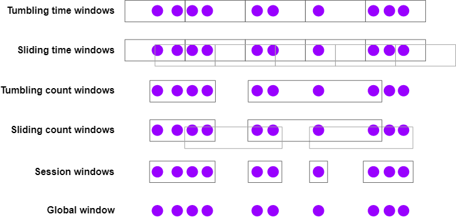

## Flink 

### Flink 执行步骤

1. Flink 启动环境
```scala
import org.apache.flink.streaming.api.scala.StreamExecutionEnvironment 

val env = StreamExecutionEnvironment.getExecutionEnvironment
```
2. Flink Source
```scala
val array = Array.apply(Person("dt", 1),Person("dt", 2),Person("dt", 3),Person("dt", 4),Person("dt", 5),Person("dt", 6),Person("dt", 7),Person("dt", 8),Person("dt", 9))
val source = env.fromElements(array:_*).name("source-1").uid("source-1")
```
3. Flink Sink
```scala
source.keyBy(k => k.name).print()
```
4. Flink 执行
```scala
// flink 执行
env.execute("flink-store")
```

### Flink 窗口函数

#### 支持的时间定义

- 事件时间(event time): 事件产生时间，记录的是设备生产 (或者存储)事件的时间
- 摄取时间(ingestion time): Flink 读取事件时记录的时间
- 处理时间(processing time): Flink pipeline 中具体算子处理事件的时间

#### 事件时间 (Event Time)
使用事件时间，需要额外给 Flink 提供一个时间戳提取器和 Watermark 生成器，Flink 将使用它们来跟踪事件时间的进度。

##### 水位线 (Watermarks)

有一串混乱时间戳的事件流，如下所示，显示的数字是生成这些数据的顺序

_**··· 23 19 22 24 21 14 17 13 12 15 9 11 7 2 4 →**_

如果使用事件时间窗口, 数据到达 Flink 的时间不一致，什么时候指定时间的数据到打完不清楚，流数据是无界的不可能一直等待，
这个时候就需要用到水位线(WaterMarks). 水位线以下的数据判断在指定的窗口内，超过该水位线的数据则指定为下一个窗口的数据，就算生产时间是在上一个窗口以内，也指定为下一个.

我们可能会思考，如何决定水位线(watermarks) 的不同生成策略

每个时间都会延迟一段时间后到达，然后这些延迟有所不同，有些事件可能比其他事件延迟得更多。一种简单的方法是假定这些延迟受某个最大延迟的限制。 Flink
将此策略称为最大无序边界(bounded-out-of-orderness)水位线。当然我们可以想象出更好的生成水位线的方法，但是对于大多数应用而言，固定延迟策略已经足够。

##### 延迟和正确性

使用水位线就会产生数据的延迟，这需要开发者在延迟和数据完整性之间做一个权衡。
与批处理不同，批处理的输入数据是已经固定的，流式数据是无界的。

##### 使用水位线(WaterMarks)

```scala

    // 设置 watermark 间隔时间
    env.getConfig.setAutoWatermarkInterval(60000)

    val windowStream = stream
      // 设置 eventTime 字段
      .assignAscendingTimestamps(_.productionDate)
      /**
       * 当流中存在时间乱序问题，引入 watermark, 并设置延迟时间
       * 传入的参数为 watermark 的最大延迟时间（即允许数据迟到的时间）
       * 重写的extractTimestamp方法返回的是设置数据中EventTime的字段，单位为毫秒，需要将时间转换成Long（最近时间为13位的长整形）才能返回
       * 当我们能大约估计到流中的最大乱序时，建议使用此中方式，比较方便
       */
      /*      .assignTimestampsAndWatermarks(WatermarkStrategy.forBoundedOutOfOrderness[Product](Duration.ofMinutes(1L))
              .withIdleness(Duration.ofMillis(1L))
              .withTimestampAssigner(new SerializableTimestampAssigner[Product] {
                override def extractTimestamp(element: Product, recordTimestamp: Long): Long = element.productionDate
              }))*/
      .keyBy(_.name)
      .window(TumblingEventTimeWindows.of(Time.minutes(1L)))
      .process(new WindowMaxProcess)
      .uid("flink-operator-window").name("flink-operator-window")
```
#### 窗口分配器



- 滚动时间窗口
    - 每分钟页面浏览量
    - TumblingEventTimeWindows.of(Time.minutes(1))
- 滑动窗口
    - TumblingEventTimeWindows.of(Time.minutes(1))
    - SlidingEventTimeWindows.of(Time.minutes(1), Time.seconds(10))
- 会话窗口
    - 每个会话的网页浏览量，其中会话之间的间隔至少为30分钟
    - EventTimeSessionWindows.withGap(Time.minutes(30))
    
基于时间的窗口分配器(包括会话时间)，既可以处理事件时间，也可以处理处理时间，这两种基于时间的处理没有哪一个更好，都必须折衷。
使用处理时间，需要接受以下限制:
- 无法正确处理历史数据,
- 无法正确处理超过最大无序边界的数据,
- 结果将是不确定的
优势是延迟相对处理时间要低
  
#### 深入了解窗口操作

1. 滑动窗口是通过复制来实现的
   
    滑动窗口分配器可以创建许多窗口对象，并将每个时间复制到每个相关的窗口中。例如，如果您每隔 15 分钟就有 24 小时的滑动窗口，则每个事件将被复制到 4 * 24 = 96 个窗口中。
2. 时间窗口会和时间对齐
   
   仅仅因为我们使用的是一个小时的处理时间窗口并在 12:05 开始运行您的应用程序，并不意味着第一个窗口将在 1:05 关闭。第一个窗口将长 55 分钟，并在 1:00 关闭。
3. window 后面可以接 window
```scala
stream
.keyBy(t -> t.key)
.window(<window assigner>)
.reduce(<reduce function>)
.windowAll(<same window assigner>)
.reduce(<same reduce function>)
```
4. 空的时间窗口不会输出结果
   
   事件会触发窗口的创建。换句话说，如果在特定的窗口内没有事件，就不会有窗口，就不会有输出结果。
5. Late Events Can Cause Late Merges
   
   会话窗口的实现是基于窗口的一个抽象能力，窗口可以 聚合。会话窗口中的每个数据在初始被消费时，都会被分配一个新的窗口，但是如果窗口之间的间隔足够小，多个窗口就会被聚合。延迟事件可以弥合两个先前分开的会话间隔，从而产生一个虽然有延迟但是更加准确地结果。

